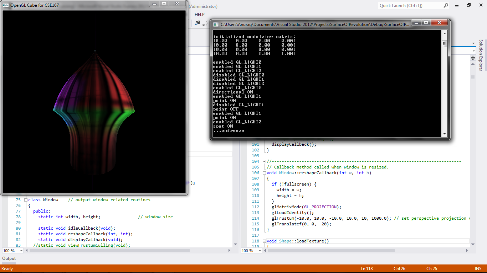

CSE 167 - Introduction to Computer Graphics

Project 6: Surface of Revolution
===================

(See full project specifications here: http://ivl.calit2.net/wiki/index.php/Project6Fall13)

Renders two connected bezier curves defined by 4 control points each and 20 interpolated points each (the two curves share a control point where they are connected). These curves are rotated around the y-axis to produce a shape. A texture is applied to this shape and lighted up. The control points can be changed and moved by mouse click. The shape can be rotated and moved by mouse click. The scene itself can be translated, rotated, and scaled using keyboard commands as in cube but is not advisable.

Mouse:
* left-click: If in freeze mode, click and drag control points to move them around and change bezier curve shape. If not in freeze mode, click and drag to rotate object using ```trackballRotation``` in ```Shape.cpp```.
* right-click: Click and drag to always scale the object (regardless of freeze mode).

Toggles:
* r: Toggle freeze mode. If freeze mode is on (which it is by default), mouse controls will move the control points to form new bezier curves. If freeze mode is off, mouse controls will move the object and keep control points fixed at their current values.
* t: Toggle applying the texture or not. The texture itself can be changed (default is ```animus.ppm``` in the ```loadTexture``` method in ```Shape.cpp```) to any ppm file in the directory.
* 1: Toggle red directional light shining from slightly above xz plane.
* 2: Toggle green point light shining object from below.
* 3: Toggle blue spot light shining straight onto the object from -x direction.



